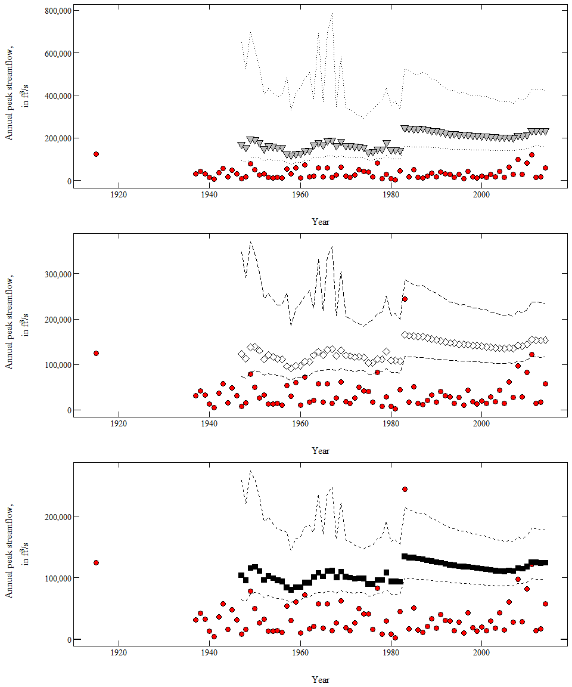

Run PeakfqSA in 1-year Intervals
================

Overview
--------

This script was developed to evaluate trends in sequential runs of the Expected Moments Algorithm (EMA) on chunks of peak-flow data to evaluate changes in the 2-percent, 1-percent, and 0.2-percent annual exceedance probability (AEP) as peak-flow values are added over time.

``` r
# the working directory must be set to the location of the PeakfqSA installation
setwd("C:/.../PeakfqSA")

# USGS streamflow-gaging station site number
site <- "07069500"

# get the peak-flow file
pkFile <- dataRetrieval::readNWISpeak(site, convertType = FALSE)

# change the -00 to -01 on the historic peak in the file
pkFile[1,3] <- "1915-08-01"

# convert the character column peak_dt to class Date
pkFile$peak_dt <- as.Date(pkFile$peak_dt, format = "%Y-%m-%d")

# add the H, for a historic peak
pkFile[1,6] <- "H"

# add the path to the location of the PeakfqSA installation
pkPath <- "C:/.../PeakfqSA"

# run the iterateEMA function
emaComp <- iterateEMA(pkFile = pkFile, pkPath = pkPath, beginYrH = 1915, beginYr = 1937, endYr = 2014, threshold = 125000, 
                      skewOpt = "WEIGHTED", genSkew = -0.17, skewSD = 0.348)

# change peak values to numeric
pkFile$peak_va <- as.numeric(pkFile$peak_va)

# add the water year as a numeric value
pkFile$wYear <- as.numeric(as.character(smwrBase::waterYear(pkFile$peak_dt)))

# plot the 0.2-percent AEPs and confidence intervals
p1 <- ggplot() +
  geom_point(data = pkFile, aes(x = wYear, y = peak_va), 
             alpha = 1, fill = "red", pch = 21, size = 3) +
  geom_point(data = emaComp, aes(x = endYear, y = Q500),
             alpha = 1, fill = "grey", pch = 25, size = 3) +
  geom_line(data = emaComp, aes(x = endYear, y = upperCI500), linetype = "dotted") +
  geom_line(data = emaComp, aes(x = endYear, y = lowerCI500), linetype = "dotted") +
  scale_y_continuous(labels = comma) +
  annotation_logticks(sides = "rl", size = 0.1) +
  labs(x = "Year", y = expression(atop("Annual peak streamflow,", paste("in ft"^"3","/s")))) +
  theme_USGS()

# plot the 1-percent AEPs and confidence intervals
p2 <- ggplot() +
  geom_point(data = pkFile, aes(x = wYear, y = peak_va), 
             alpha = 1, fill = "red", pch = 21, size = 3) +
  geom_point(data = emaComp, aes(x = endYear, y = Q100),
             alpha = 1, fill = "white", pch = 23, size = 3) +
  geom_line(data = emaComp, aes(x = endYear, y = upperCI100), linetype = "longdash") +
  geom_line(data = emaComp, aes(x = endYear, y = lowerCI100), linetype = "longdash") +
  scale_y_continuous(labels = comma) +
  annotation_logticks(sides = "rl", size = 0.1) +
  labs(x = "Year", y = expression(atop("Annual peak streamflow,", paste("in ft"^"3","/s")))) +
  theme_USGS()

# plot the 2-percent AEPs and confidence intervals
p3 <- ggplot() +
  geom_point(data = pkFile, aes(x = wYear, y = peak_va), 
             alpha = 1, fill = "red", pch = 21, size = 3) +
  geom_point(data = emaComp, aes(x = endYear, y = Q50),
             alpha = 1, fill = "black", pch = 22, size = 3) +
  geom_line(data = emaComp, aes(x = endYear, y = upperCI50), linetype = "dashed") +
  geom_line(data = emaComp, aes(x = endYear, y = lowerCI50), linetype = "dashed") +
  scale_y_continuous(labels = comma) +
  annotation_logticks(sides = "rl", size = 0.1) +
  labs(x = "Year", y = expression(atop("Annual peak streamflow,", paste("in ft"^"3","/s")))) +
  theme_USGS()

drawTicks3(p1, p2, p3)
```


