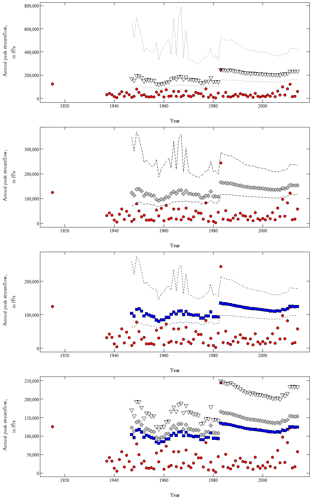

Run PeakfqSA in 1-year Intervals
================

Overview
--------

This script was developed to evaluate trends in sequential runs of the Expected Moments Algorithm (EMA) on chunks of peak-flow data to evaluate changes in the 2-percent, 1-percent, and 0.2-percent annual exceedance probability (AEP) as peak-flow values are added over time.

``` r
# the working directory must be set to the location of the PeakfqSA installation
setwd("C:/.../PeakfqSA")

# USGS streamflow-gaging station site number
site <- "07069500"

# get the peak-flow file
pkFile <- readNWISpeak(site, convertType = FALSE)

# change any -00 days to -01 days on the historic peaks in the file
pkFile$peak_dt <- dplyr::if_else(stringr::str_sub(pkFile$peak_dt, start = 9, end = 10) == "00", 
                                 paste0(stringr::str_sub(pkFile$peak_dt, 1, 8), "01"), pkFile$peak_dt)

# convert the character column peak_dt to class Date
pkFile$peak_dt <- as.Date(pkFile$peak_dt, format = "%Y-%m-%d")

# add the H, for a historic peak
pkFile[1,6] <- "H"

# add the path to the location of the PeakfqSA installation
pkPath <- "C:/.../PeakfqSA"

# run the iterateEMA function
emaComp <- iterateEMA(pkFile = pkFile, pkPath = pkPath, beginYrH = 1915, beginYr = 1937, endYr = 2014, threshold = 125000, 
                      skewOpt = "WEIGHTED", genSkew = -0.17, skewSD = 0.348)

kable(emaComp)
```

|  endYear|        Q50|  upperCI50|  lowerCI50|       Q100|  upperCI100|  lowerCI100|      Q500|  upperCI500|  lowerCI500|
|--------:|----------:|----------:|----------:|----------:|-----------:|-----------:|---------:|-----------:|-----------:|
|     2014|  124695.04|   97876.69|   178278.5|  153378.91|   116244.16|    234877.9|  233221.5|   161486.61|    422948.6|
|     2013|  124049.01|   97080.24|   178423.9|  152924.20|   115506.74|    235917.9|  233795.6|   161184.11|    428583.2|
|     2012|  124988.63|   97736.10|   179935.3|  153922.60|   116171.89|    237635.0|  234646.0|   161649.17|    430307.0|
|     2011|  125662.40|   98274.48|   180785.1|  154449.75|   116605.79|    238164.6|  234301.3|   161520.46|    428592.6|
|     2010|  118208.09|   93008.10|   168447.2|  144281.54|   109706.56|    219872.0|  215617.5|   150082.64|    387573.5|
|     2009|  114902.42|   90422.10|   163872.6|  140128.93|   106575.87|    213768.2|  209156.6|   145668.15|    376550.7|
|     2008|  116034.85|   91014.60|   166419.1|  141751.62|   107417.34|    217689.8|  212334.4|   147204.41|    385832.8|
|     2007|  110834.61|   87209.30|   158277.4|  134880.50|   102589.59|    206040.5|  200448.7|   139680.17|    361394.6|
|     2006|  111944.89|   87786.99|   160789.8|  136467.59|   103408.81|    209899.3|  203541.5|   141170.61|    370482.5|
|     2005|  110558.58|   86487.17|   159653.8|  134995.37|   102009.63|    209012.7|  202189.8|   139750.90|    371598.0|
|     2004|  111372.46|   87080.27|   160881.1|  135785.73|   102567.75|    210230.5|  202577.1|   139990.13|    371968.0|
|     2003|  111651.94|   86940.53|   162553.3|  136511.38|   102637.48|    213377.6|  204996.7|   140829.48|    381609.8|
|     2002|  112747.75|   87653.53|   164519.0|  137782.22|   103423.10|    215869.2|  206552.9|   141636.62|    385491.7|
|     2001|  113925.06|   88218.17|   167399.3|  139516.15|   104262.81|    220405.1|  210098.3|   143271.52|    396668.5|
|     2000|  114726.99|   88825.91|   168526.2|  140221.35|   104794.63|    221328.0|  210107.1|   143335.25|    395782.7|
|     1999|  116010.15|   89615.54|   171004.2|  141795.86|   105716.61|    224667.7|  212363.5|   144463.99|    401891.6|
|     1998|  116674.28|   90170.97|   171758.3|  142243.95|   106130.49|    224895.4|  211705.0|   144204.22|    398939.2|
|     1997|  117937.21|   90973.16|   174082.9|  143708.37|   107010.86|    227846.1|  213497.5|   145097.48|    403562.8|
|     1996|  118475.89|   90935.72|   176538.0|  144844.65|   107258.08|    232288.0|  216830.6|   146340.36|    416608.6|
|     1995|  118708.91|   91262.94|   176351.9|  144618.84|   107310.67|    230962.2|  214740.3|   145369.07|    409683.0|
|     1994|  120247.74|   92046.32|   179976.6|  146780.94|   108396.87|    236475.5|  218825.4|   147267.75|    422488.6|
|     1993|  121155.34|   92720.96|   181244.0|  147524.85|   108944.03|    237389.1|  218571.6|   147149.41|    420772.0|
|     1992|  122788.83|   93513.05|   185270.1|  149877.80|   110086.97|    243623.8|  223195.8|   149269.39|    435673.0|
|     1991|  124428.04|   94260.77|   189528.3|  152306.82|   111217.85|    250358.6|  228186.4|   151507.72|    452356.7|
|     1990|  125432.30|   94464.13|   193199.5|  154103.31|   111794.03|    256721.8|  232809.2|   153320.70|    470302.0|
|     1989|  127019.79|   95451.00|   196227.5|  155911.23|   112854.71|    260508.4|  234878.3|   154311.79|    475911.1|
|     1988|  128703.98|   96139.57|   201005.3|  158490.71|   113964.54|    268255.5|  240448.0|   156684.47|    495976.4|
|     1987|  130681.07|   97247.87|   205319.0|  160999.51|   115302.44|    274321.2|  244328.4|   158463.04|    508192.9|
|     1986|  131347.52|   97860.11|   205774.2|  161167.82|   115610.76|    273451.8|  242238.0|   157520.03|    500033.2|
|     1985|  132782.54|   98826.33|   208185.0|  162538.95|   116488.87|    275827.9|  242794.5|   157779.69|    500538.8|
|     1984|  132936.99|   98300.98|   211150.2|  163411.97|   116275.49|    281664.2|  246487.0|   158773.56|    519413.9|
|     1983|  134840.43|   99462.11|   214887.5|  165534.33|   117491.45|    286243.5|  248736.9|   159800.43|    525723.2|
|     1982|   93461.73|   73236.42|   155058.5|  107706.93|    81861.75|    199720.1|  142217.4|   100900.62|    334921.0|
|     1981|   94245.81|   73228.13|   161699.8|  109001.18|    82025.26|    212412.6|  145006.1|   101582.21|    374128.0|
|     1980|   94262.01|   73445.50|   159323.8|  108783.70|    82150.86|    206887.9|  144103.5|   101427.36|    354129.6|
|     1979|  108768.10|   80795.73|   191277.0|  128846.56|    92410.14|    250681.6|  179194.1|   118437.41|    430854.6|
|     1978|   96589.79|   74730.61|   166329.0|  111540.50|    83593.53|    217140.7|  147842.8|   103141.13|    376189.4|
|     1977|   96539.18|   74934.94|   163504.7|  111206.60|    83683.05|    210913.9|  146686.6|   102890.90|    355108.5|
|     1976|   90355.83|   70584.05|   153282.7|  103516.96|    78434.40|    198220.7|  135093.8|    95577.66|    337861.5|
|     1975|   90296.66|   70774.66|   150654.7|  103192.28|    78516.22|    192439.8|  134014.1|    95342.79|    318318.5|
|     1974|   98935.72|   75909.54|   147295.0|  115632.53|    85874.64|    183619.1|  156721.5|   106993.21|    291134.3|
|     1973|   99494.23|   75804.54|   150963.2|  116732.07|    86084.86|    189693.2|  159570.2|   108143.67|    306114.3|
|     1972|   98609.46|   75066.57|   153107.9|  116046.11|    85526.64|    193749.7|  159766.0|   108218.39|    317536.4|
|     1971|  100602.83|   75972.24|   158235.6|  118739.67|    86748.25|    201191.7|  164456.0|   110227.03|    333181.9|
|     1970|  101976.29|   77053.28|   161905.3|  120037.98|    87804.00|    205610.6|  165151.8|   110968.02|    339185.5|
|     1969|  110240.34|   78952.45|   221898.3|  130829.95|    90124.48|    304209.7|  182679.5|   115154.67|    581112.5|
|     1968|  100842.61|   75544.57|   162782.0|  118810.13|    86120.65|    207321.6|  163766.0|   108927.24|    344244.3|
|     1967|  111743.87|   78070.31|   248482.9|  133601.32|    89443.18|    359458.5|  189334.3|   115211.74|    788858.3|
|     1966|  111096.74|   78216.84|   238675.4|  132142.48|    89303.77|    336382.8|  185369.5|   114208.66|    690051.1|
|     1965|  102088.89|   75225.24|   170371.9|  120570.46|    85886.69|    218442.9|  166967.7|   108906.89|    368015.5|
|     1964|  107947.48|   75945.09|   234973.8|  127917.03|    86410.10|    332047.9|  178157.4|   109802.01|    689733.2|
|     1963|  101500.58|   73882.99|   173425.0|  120077.42|    84438.05|    223368.8|  166860.8|   107277.93|    380144.3|
|     1962|   92282.60|   68619.90|   185654.0|  106353.97|    76242.03|    262476.6|  140739.5|    93138.26|    508534.5|
|     1961|   92171.51|   68936.55|   181990.8|  105816.11|    76421.74|    250922.5|  138969.5|    92909.52|    478056.2|
|     1960|   84912.46|   63969.80|   166717.3|   96984.47|    70577.33|    234398.4|  126178.5|    85151.13|    436943.2|
|     1959|   84816.24|   64262.93|   163466.0|   96502.22|    70740.10|    223437.5|  124607.4|    84929.59|    409451.1|
|     1958|   80642.36|   59973.75|   144543.9|   91683.27|    65203.76|    186474.2|  118327.6|    76942.17|    328763.5|
|     1957|   84184.72|   62478.36|   174384.9|   96310.79|    68954.09|    257508.1|  125761.0|    83431.77|    481661.0|
|     1956|   94208.47|   65781.17|   177047.5|  111460.85|    75093.15|    230541.2|  154905.8|    95194.65|    402074.9|
|     1955|   96044.01|   66772.77|   179148.6|  112968.25|    75814.99|    231434.6|  154893.7|    94966.49|    396473.9|
|     1954|   99629.70|   68713.88|   188082.6|  116999.57|    77851.56|    242530.4|  159679.9|    96965.62|    413470.1|
|     1953|  102784.76|   70824.15|   198662.9|  120219.72|    79954.10|    255554.5|  162496.2|    98682.74|    432430.9|
|     1952|   96681.06|   67781.56|   190536.2|  111849.25|    75871.45|    243553.9|  148573.3|    92895.60|    405006.9|
|     1951|  111033.91|   74086.73|   231720.2|  130472.11|    83929.21|    302405.3|  177823.4|   104153.45|    527438.5|
|     1950|  117780.20|   76348.36|   261520.0|  139454.58|    86986.14|    346593.2|  192977.5|   109094.56|    624799.1|
|     1949|  115733.44|   73003.09|   274469.9|  137925.73|    83706.88|    370488.1|  193618.4|   106450.90|    695980.8|
|     1948|   95881.48|   61199.95|   219990.0|  112854.07|    69421.60|    291176.3|  154480.3|    86495.54|    524550.4|
|     1947|  104158.01|   64470.83|   258283.7|  123213.88|    73393.20|    347778.6|  170217.8|    92038.70|    647220.1|

``` r
# change peak values to numeric
pkFile$peak_va <- as.numeric(pkFile$peak_va)

# add the water year as a numeric value
pkFile$wYear <- as.numeric(as.character(smwrBase::waterYear(pkFile$peak_dt)))

# plot the 0.2-percent AEPs and confidence intervals
p1 <- ggplot() +
  geom_point(data = pkFile, aes(x = wYear, y = peak_va), 
             alpha = 1, fill = "red", pch = 21, size = 3) +
  geom_point(data = emaComp, aes(x = endYear, y = Q500),
             alpha = 1, fill = NA, pch = 25, size = 3) +
  geom_line(data = emaComp, aes(x = endYear, y = upperCI500), linetype = "dotted") +
  geom_line(data = emaComp, aes(x = endYear, y = lowerCI500), linetype = "dotted") +
  scale_y_continuous(labels = comma) +
  labs(x = "Year", y = expression(atop("Annual peak streamflow,", paste("in ft"^"3","/s")))) +
  theme_USGS()

# plot the 1-percent AEPs and confidence intervals
p2 <- ggplot() +
  geom_point(data = pkFile, aes(x = wYear, y = peak_va), 
             alpha = 1, fill = "red", pch = 21, size = 3) +
  geom_point(data = emaComp, aes(x = endYear, y = Q100),
             alpha = 1, fill = "grey", pch = 23, size = 3) +
  geom_line(data = emaComp, aes(x = endYear, y = upperCI100), linetype = "longdash") +
  geom_line(data = emaComp, aes(x = endYear, y = lowerCI100), linetype = "longdash") +
  scale_y_continuous(labels = comma) +
  labs(x = "Year", y = expression(atop("Annual peak streamflow,", paste("in ft"^"3","/s")))) +
  theme_USGS()

# plot the 2-percent AEPs and confidence intervals
p3 <- ggplot() +
  geom_point(data = pkFile, aes(x = wYear, y = peak_va), 
             alpha = 1, fill = "red", pch = 21, size = 3) +
  geom_point(data = emaComp, aes(x = endYear, y = Q50),
             alpha = 1, fill = "blue", pch = 22, size = 3) +
  geom_line(data = emaComp, aes(x = endYear, y = upperCI50), linetype = "dashed") +
  geom_line(data = emaComp, aes(x = endYear, y = lowerCI50), linetype = "dashed") +
  scale_y_continuous(labels = comma) +
  labs(x = "Year", y = expression(atop("Annual peak streamflow,", paste("in ft"^"3","/s")))) +
  theme_USGS()

# plot the 0.2, 1, and 2-percent AEPs without the confidence intervals
p4 <- ggplot() +
  geom_point(data = pkFile, aes(x = wYear, y = peak_va),
             alpha = 1, fill = "red", pch = 21, size = 3) +
  geom_point(data = emaComp, aes(x = endYear, y = Q500),
             alpha = 1, fill = NA, pch = 25, size = 3) +
  geom_point(data = emaComp, aes(x = endYear, y = Q100),
             alpha = 1, fill = "grey", pch = 23, size = 3) +
  geom_point(data = emaComp, aes(x = endYear, y = Q50),
             alpha = 1, fill = "blue", pch = 22, size = 3) +
  scale_y_continuous(labels = comma) +
  labs(x = "Year", y = expression(atop("Annual peak streamflow,", paste("in ft"^"3","/s")))) +
  theme_USGS()
  
drawTicks4(p1, p2, p3, p4)
```


