Peak-flow Trend Analyses
================

Overview
========

This script was developed to demonstrate some functions developed to analyze trends in peak flows at several U.S. Geological Survey (USGS) streamflow-gaging stations in Arkansas.

Map the sites
-------------

For the purposes of looking at the distribution of the sites throughout the state, make a map to the location of the sites.

``` r
# create a vector of the site IDs
siteIDs <- c("07048600", "07060710", "07069500", "07072000", "07075300", "07194800", 
             "07247000", "07249400", "07260000", "07263000", "07264000", "07340000", 
             "07340300", "07341200", "07361500", "07362100", "07363500", "07074000")

# get some information about the sites
siteInfo <- dataRetrieval::readNWISsite(siteIDs)

# create a map of the site locations
# create a vector for the bounding box
forLocation <- c(min(siteInfo$dec_long_va) - 2, min(siteInfo$dec_lat_va) - 2, 
                 max(siteInfo$dec_long_va) + 2, max(siteInfo$dec_lat_va) + 2)

# create a base map using the lat/long coordinates in the spatialPointsDataFrame
baseMap <- ggmap::get_map(location = forLocation, maptype = "terrain")

# add the sites to the baseMap and store it
map <- ggmap(baseMap) +
  geom_point(data = siteInfo, aes(x = dec_long_va, y = dec_lat_va),
             alpha = 1, fill = "red", pch = 21, size = 3) +
  labs(x = "Longitude", y = "Latitude") +
  geom_text_repel(data = siteInfo, aes(x = dec_long_va, y = dec_lat_va, label = site_no),
                  family = "serif") +
  theme_USGS()

# add the ticks to the map and draw it
drawTicks(map)
```

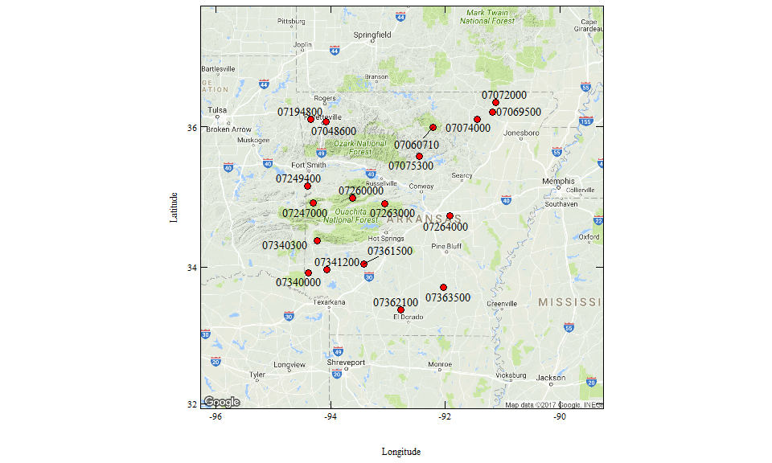

Run the Kendall Test on the Peak Flows
--------------------------------------

Use the `pkKendallTest()` function to obtain the trend test results.

``` r
# apply the function to the vector of site IDs in parallel
# how many cores are available on the machine
library(doParallel); detectCores()
```

    ## [1] 8

``` r
# designate the number of cores to use
cl <- makePSOCKcluster(detectCores() - 4)

# get the core cluster
clusterEvalQ(cl, library(foreach)); registerDoParallel(cl)

# run the function in parallel across 4 cores
pkTrends <- foreach(j = 1:length(siteIDs), .combine = dplyr::bind_rows, 
  .packages = c("dplyr", "dataRetrieval", "Kendall", "smwrBase")) %dopar%
  (pkKendallTest(site = siteIDs[j]))

# stop the cluster
stopCluster(cl)

# print the results
kable(pkTrends)
```

| site\_no |         tau|         sl|      S|          D|       varS|
|:---------|-----------:|----------:|------:|----------:|----------:|
| 07048600 |   0.0538183|  0.5754309|     74|  1374.9967|  16988.666|
| 07060710 |   0.0966741|  0.3370821|    109|  1127.4999|  12657.667|
| 07069500 |   0.0110551|  0.8888850|     34|  3075.4951|  55788.000|
| 07072000 |   0.0323768|  0.6681384|    110|  3397.4956|  64645.332|
| 07075300 |   0.0392442|  0.6843054|     54|  1375.9985|  16991.334|
| 07194800 |   0.1052633|  0.4872200|     29|   275.4995|   1624.333|
| 07247000 |  -0.0443186|  0.5689929|   -133|  3000.9995|  53716.332|
| 07249400 |   0.1216730|  0.1758065|    208|  1709.4994|  23380.000|
| 07260000 |  -0.0281570|  0.7363532|    -66|  2343.9990|  37271.332|
| 07263000 |  -0.2074758|  0.0097007|   -544|  2621.9932|  44079.332|
| 07264000 |  -0.0542987|  0.5445462|    -96|  1767.9989|  24579.334|
| 07340000 |  -0.3826351|  0.0000002|  -1397|  3650.9978|  71873.664|
| 07340300 |  -0.0949002|  0.3461058|   -107|  1127.4999|  12657.667|
| 07341200 |  -0.2223098|  0.0219770|   -283|  1272.9985|  15154.333|
| 07361500 |  -0.0072202|  0.9368206|    -15|  2077.4985|  31194.334|
| 07362100 |  -0.0193084|  0.8086331|    -55|  2848.4995|  49713.668|
| 07363500 |  -0.0830000|  0.2845940|   -249|  2999.9985|  53714.332|
| 07074000 |  -0.0068248|  0.9325217|    -21|  3076.9973|  55792.332|

Plot the peak flow data with a LOESS curve
------------------------------------------

``` r
# run a loop to print and expor the graphs to pdfs
for (i in seq(1, length(siteIDs), 1)) {
  
  # create an object to store the site number
  theSite <- siteIDs[i]
  
  # get the peak flow data, don't convert dates to class Date
  pk <- readNWISpeak(theSite, convertType = FALSE)
  
  # replace any -00 vaules for days with -01
  pk$peak_dt <- dplyr::if_else(stringr::str_sub(pk$peak_dt, start = 9, end = 10) == "00",
                               paste0(stringr::str_sub(pk$peak_dt, 1, 8), "01"), pk$peak_dt)
  
  # change the dates to class Date
  pk$peak_dt <- as.Date(pk$peak_dt, format = "%Y-%m-%d")
  
  # convert the peak-flows to a numeric value
  pk$peak_va <- as.numeric(pk$peak_va)
  
  # get rid of rows with no peak-flow data
  pk <- filter(pk, !is.na(peak_va))
  
  # add a numeric column for water year to the data
  pk$wYear <- as.numeric(as.character(smwrBase::waterYear(pk$peak_dt)))

  # create the plot
  p <- ggplot(data = pk, aes(x = wYear, y = peak_va)) +
    geom_bar(stat = "identity", fill = "red", color = "black") +
    scale_y_continuous(labels = comma, expand = c(0,0)) +
    stat_smooth(method = "loess", span = 0.75) +
    labs(y = expression(atop("Annual peak streamflow,", paste("in ft"^"3","/s"))), 
         x = "Water year") +
    annotate("text", x = mean(pk$wYear), y = 0.9*max(pk$peak_va),
              label = paste0("USGS ", theSite), family = "serif", size = 3) +
    theme_box()
  
  drawTicksY(p)
}
```

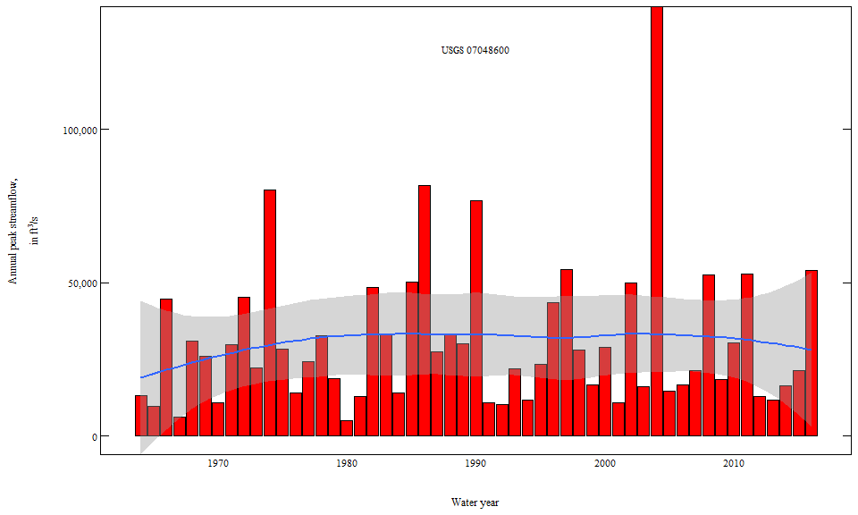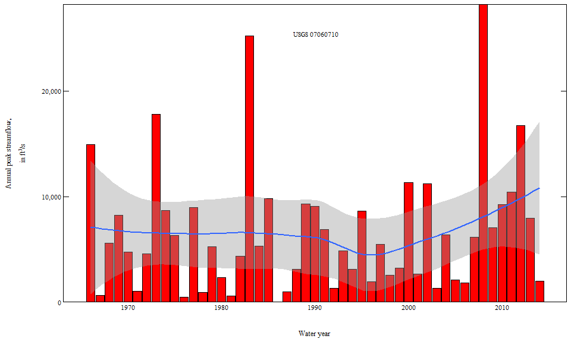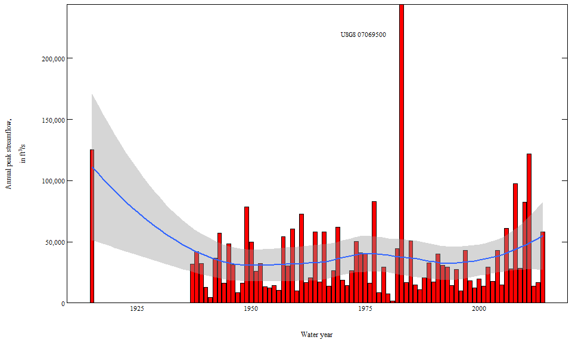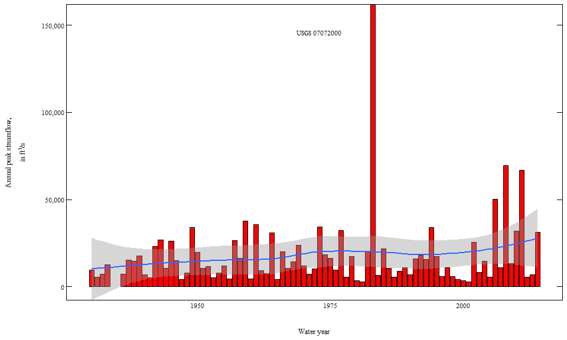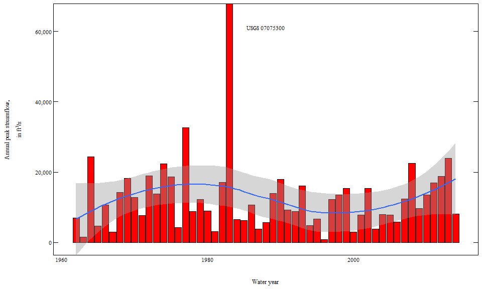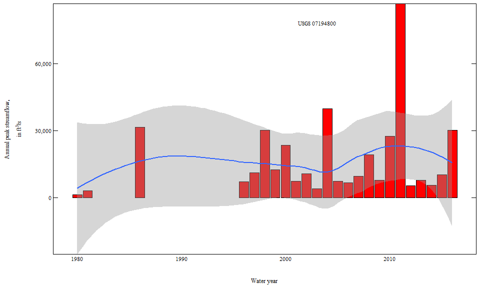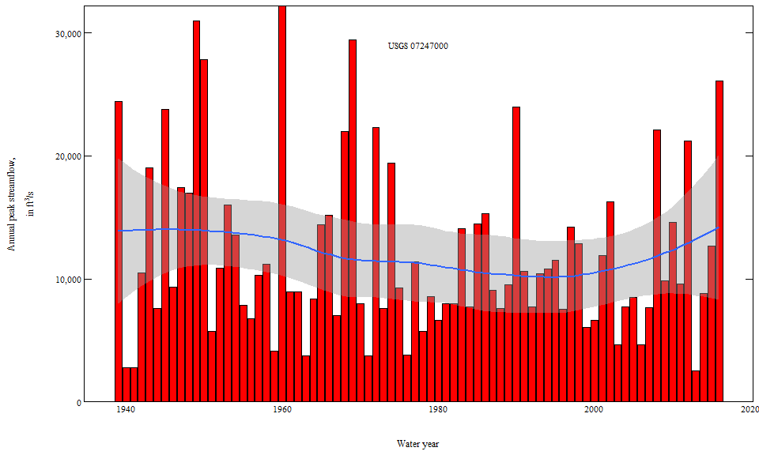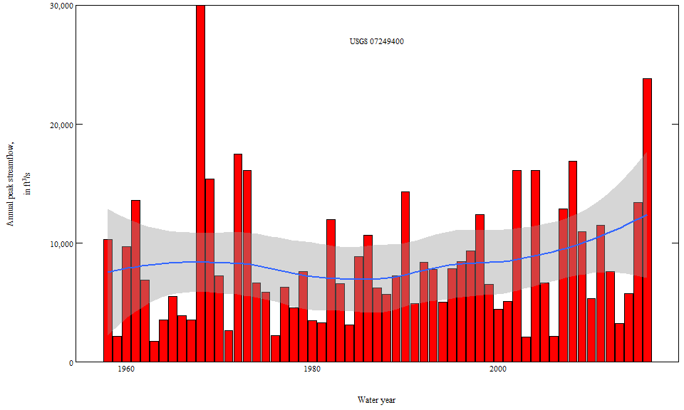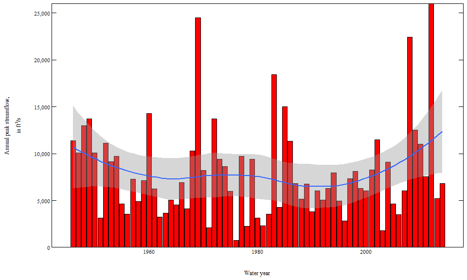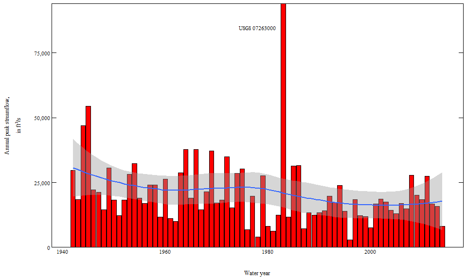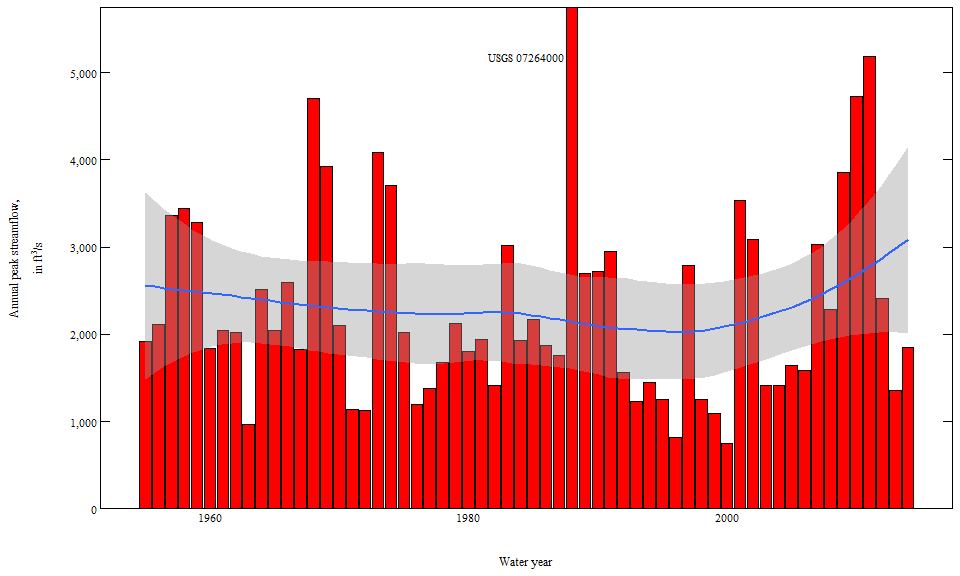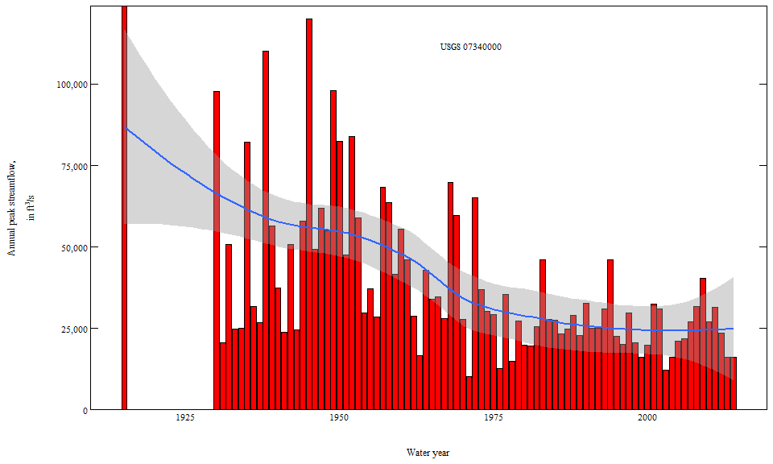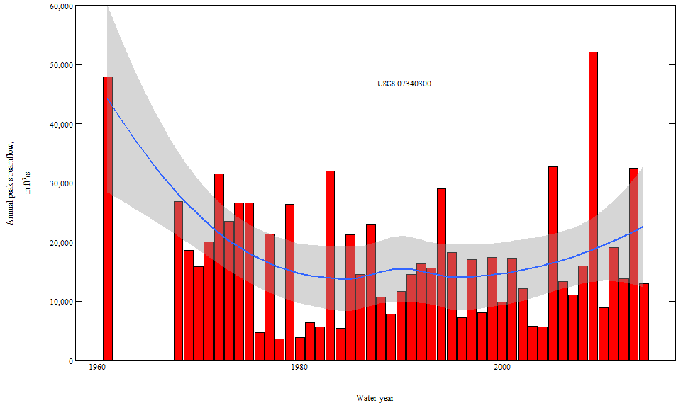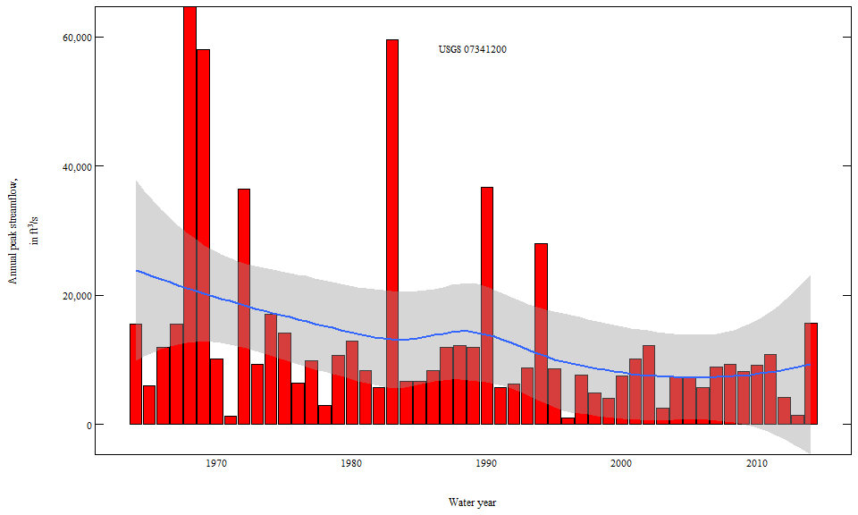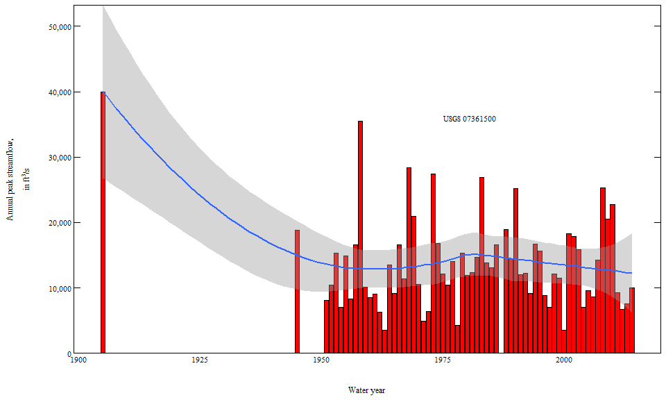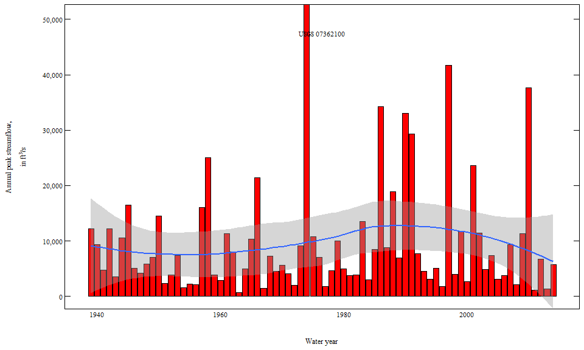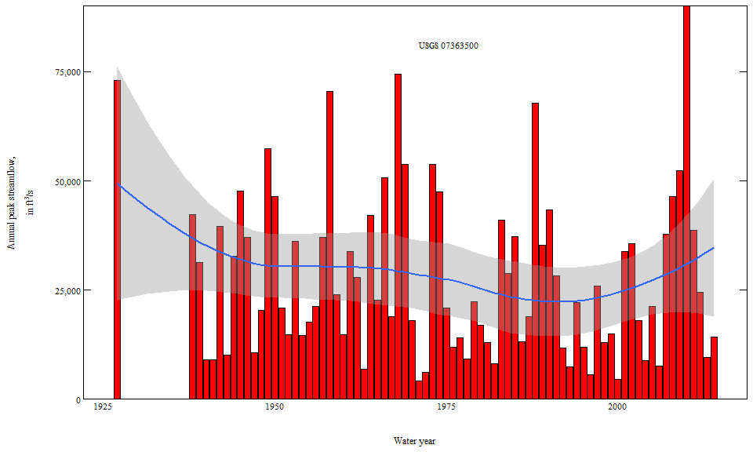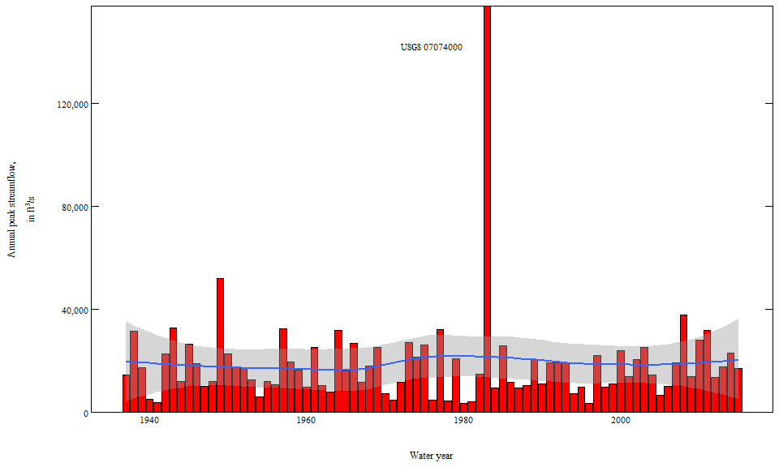
